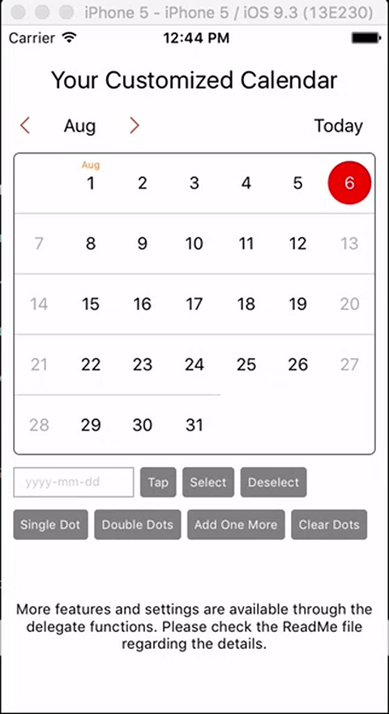

# YFCalendar

[](https://travis-ci.org/pushian/YFCalendar)
[](http://cocoapods.org/pods/YFCalendar)
[](http://cocoapods.org/pods/YFCalendar)
[](http://cocoapods.org/pods/YFCalendar)



## Example

To run the example project, clone the repo, and run `pod install` from the Example directory first.

## Requirements

## Installation

YFCalendar is available through [CocoaPods](http://cocoapods.org). To install
it, simply add the following line to your Podfile:

```ruby
pod "YFCalendar"
```
##How To Use
###Initialization
```swift
var calendarView = YFCalendarView()
calendarView.calendarViewDelegate = self
```
###Delegate Functions
- Set the general color for the date labels based on DateType and DateState.
```swift
optional func calendarView(calenderView: YFCalendarView, setGeneralColor dateType: DateType, dateState: DateState) -> UIColor?
```
- Set the general font for the date labels based on DateType and DateState.
```swift
optional func calendarView(calenderView: YFCalendarView, SetGeneralFont dateType: DateType, dateState: DateState) -> UIFont?
```
- Set the general border color for the background circle when a date is selected.
```swift
optional func calendarView(calenderView: YFCalendarView, SetSelectionCircleBorderColor dateType: DateType) -> UIColor?
```
- Set the general fill color for the background circle when a date is selected.
```swift
optional func calendarView(calenderView: YFCalendarView, SetSelectionCircleFillColor dateType: DateType) -> UIColor?
```
- Define whether to automatically select the first day when scroll to a new month.
```swift
optional func calendarView(calenderView: YFCalendarView, autoSelectTheFirstDateOfTheNewMonth mode: SelectionMode) -> Bool
```
- Will be called before the new month will be presented in the view.
```swift
optional func calendarView(calenderView: YFCalendarView, willPresentTheMonth theMonth: YFMonthView) -> Void
```
- Will be called after the new month has benn presented in the view.
```swift
optional func calendarView(calenderView: YFCalendarView, didPresentTheMonth theMonth: YFMonthView) -> Void
```
- Will be called after the date has been selected.
```swift
optional func calendarView(calenderView: YFCalendarView, didSelectADay selectedDay: YFDayView) -> Void
```
- Will be called after the date has been deselected.
```swift
optional func calendarView(calenderView: YFCalendarView, didDeselectADay deselectedDay: YFDayView) -> Void
```
- Customize the color for the date label for a specific day. This will overwrite the general settings.
```swift
optional func calendarView(calenderView: YFCalendarView, customizeColorForTheDay theDay: YFDayView, dateState: DateState) -> UIColor?
```
- Customize the font for the date label for a specific day. This will overwrite the general settings.
```swift
optional func calendarView(calenderView: YFCalendarView, customizeFontForTheDay theDay: YFDayView, dateState: DateState) -> UIFont?
```
- Customize the border color for the background circle when a specific date is selected. This will overwrite the general settings.
```swift
optional func calendarView(calenderView: YFCalendarView, customizeSelectionCircleBorderColorForTheDay theDay: YFDayView) -> UIColor?
```
- Customize the fill color for the background circle when a specific date is selected. This will overwrite the general settings.
```swift
optional func calendarView(calenderView: YFCalendarView, customizeSelectionCircleFillColorForTheDay theDay: YFDayView) -> UIColor?
```
- Customize the date view for a specific day. This will overwrite the general settings.
```swift
optional func calendarView(calenderView: YFCalendarView, customizeContentViewForTheDay theDay: YFDayView, dateState: DateState) -> UIView?
```
- Add dots on a specific date during initialization.
```swift
optional func calendarView(calenderView: YFCalendarView, initializeDotsForTheDay theDay: YFDayView) -> [UIColor]?
```
- Disable the user interaction for a specific day.
```swift
optional func calendarView(calenderView: YFCalendarView, disableUserInteractionForTheDay theDay: YFDayView) -> Bool
```
- Set the selection mode for the calendar view. The default value is .Single.
```swift
optional func calendarViewSetDateSelectionMode(calenderView: YFCalendarView) -> SelectionMode
```
- Set the scroll direction for the calendar view. The default value is .Horizontal
```swift
optional func calendarViewSetScrollDirection(calenderView: YFCalendarView) -> CalendarScrollDirection
```
- Control the animation for date selection. The default value is true.
```swift
optional func calendarViewTurnOnSelectionAnimation(calenderView: YFCalendarView) -> Bool
```
- If it is set to true, when the user tap on the dates outside of this month, the view will be automatically scrolled to the corresponding month. The default value is true.
```swift
optional func calendarViewAutoScrollToTheNewMonthWhenTabTheDateOutsideOfTheCurrentMonth(calenderView: YFCalendarView) -> Bool
```
- Whether to display the dates outside of the current month. The default value is true.
```swift
optional func calendarViewShowDateOutsideOfTheCurrentMonth(calenderView: YFCalendarView) -> Bool
```
- Whether to automatically select today when the calendar view is initialized. The default value is true.
```swift
optional func calendarViewAutoSelectToday(calenderView: YFCalendarView) -> Bool
```
- Define the raduis for the background circle when a date is selected.
```swift
optional func calendarViewSetSelectionCircleRadius(calenderView: YFCalendarView) -> CGFloat
```
- Define the border width for the background circle when a date is selected.
```swift
optional func calendarViewSetSelectionCircleBorderWidth(calenderView: YFCalendarView) -> CGFloat
```
- Define the radius for the small dots added for a date.
```swift
optional func calendarViewSetDotMarkRadius(calenderView: YFCalendarView) -> CGFloat
```
- Define the y-offset distance of the dots from the center of the date label.
```swift
optional func calendarViewSetDotMarkOffsetFromDateCenter(calenderView: YFCalendarView) -> CGFloat
```
- Define the distance between two dots.
```swift
optional func calendarViewSetDistanceBetweenDots(calenderView: YFCalendarView) -> CGFloat
```
- If the slected color of the dot marks is set to be nil, there color of the dot marks in the selection mode will be the same with the unselection mode.
```swift
optional func calendarViewSetDotMarkSelectedColor(calenderView: YFCalendarView) -> UIColor?
```
- Define the color for the top line above the date label.
```swift
optional func calendarViewSetTopLineColor(calenderView: YFCalendarView) -> UIColor?
```
- Define the thickness for the top line above the date label.
```swift
optional func calendarViewSetTopLineThickness(calenderView: YFCalendarView) -> CGFloat
```
- Whether to display the top line above the date label.
```swift
optional func calendarViewShowTopLine(calenderView: YFCalendarView) -> Bool
```

## Author

pushian, l@fooyo.sg

## License

YFCalendar is available under the MIT license. See the LICENSE file for more info.
